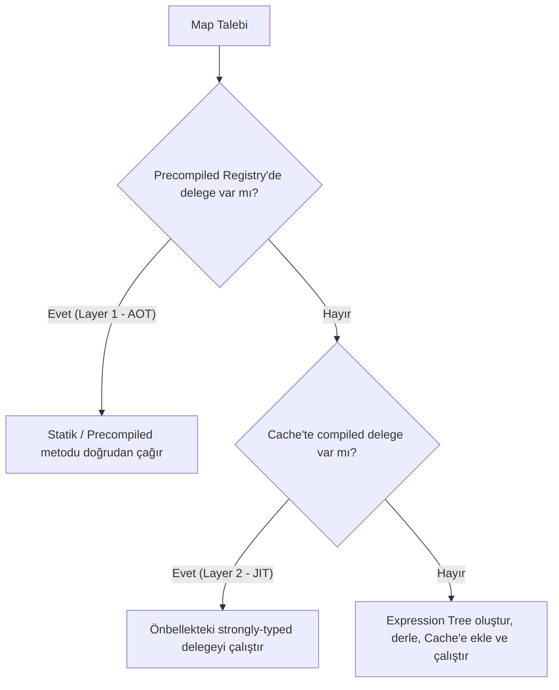

# VeloxMapper


VeloxMapper, modern .NET platformları (**.NET 8.0, .NET 9.0 ve .NET 10.0**) için tasarlanmış; performans, tip güvenliği ve **gözlemlenebilirliği (observability)** önceliklendiren, deterministik ve **fail-fast (erken hata)** tabanlı hibrit bir nesne eşleştirme (object mapping) kütüphanesidir.

### 🎯 Mottolarımız & Temel Hedefimiz
* **Minimum Efor, Sıfır Zahmet:** .NET projelerinde geliştiricilerin en az eforla AutoMapper'dan VeloxMapper'a geçmesini sağlamak.
* **Kusursuz Geliştirici Deneyimi:** Sürpriz çalışma zamanı hatalarına son veren, başlangıçta (startup) doğrulanan ve yüksek performanslı eşleştirme deneyimi.

---

## 📚 İçindekiler

1. [Proje Tanıtımı](#-1-proje-tanıtımı)
2. [Kurulum](#-2-kurulum)
3. [Hızlı Başlangıç](#-3-hızlı-başlangıç)
4. [Bağımlılık Enjeksiyonu (DI)](#-4-bağımlılık-enjeksiyonu-di)
5. [Temel Kavramlar](#-5-temel-kavramlar)
6. [Temel Eşleme](#-6-temel-eşleme) — CreateMap, Koleksiyonlar, Flattening, Dictionary, Enum
7. [Üye Özelleştirme (ForMember)](#-7-üye-özelleştirme-formember)
8. [İsimlendirme Kuralları & Prefix/Postfix](#-8-i̇simlendirme-kuralları--prefixpostfix)
9. [Resolver & Converter'lar](#-9-resolver--converterlar)
10. [BeforeMap / AfterMap](#-10-beforemap--aftermap)
11. [İleri Düzey Eşleme Senaryoları](#-11-i̇leri-düzey-eşleme-senaryoları)
12. [Proxy & Otomatik Null Propagation (v5.2.0+)](#-12-proxy--otomatik-null-propagation-v520)
13. [Patch (Mevcut Nesneye Eşleme) & Null Yönetimi](#-13-patch-mevcut-nesneye-eşleme--null-yönetimi)
14. [EF Core Projeksiyonu (ProjectTo)](#-14-ef-core-projeksiyonu-projectto)
15. [Doğrulama (Fail-Fast) & Ön Derleme](#-15-doğrulama-fail-fast--ön-derleme)
16. [Gözlemlenebilirlik: Plan Raporu & CI Hash](#-16-gözlemlenebilirlik-plan-raporu--ci-hash)
17. [Hibrit Mimari](#-17-hibrit-mimari)
18. [AutoMapper'dan Geçiş AI Promptu](#-18-automapperdan-geçiş-ai-promptu)
19. [İstisnalar](#-19-i̇stisnalar)
20. [Sürüm Notları](#-20-sürüm-notları)
21. [Lisans](#-21-lisans)

---

## 🚀 1. Proje Tanıtımı

### Hangi Problemi Çözer?
Geleneksel nesne eşleştiriciler (Object Mappers), çalışma zamanındaki belirsiz davranışları ve konfigürasyon hatalarını ancak ilgili kod satırı çalıştığında (genellikle üretim ortamında bir kullanıcı isteği sırasında) fırlatır. Bu durum, gözden kaçan eksik eşleşmelerin production hatalarına dönüşmesine yol açar. Ayrıca yoğun reflection kullanımı yüksek bellek tüketimi (allocation) ve JIT derleme yükü oluşturur.

VeloxMapper bu sorunları üç temel sütunla çözer:
1. **Deterministik ve Fail-Fast:** Tüm eşleştirme kuralları uygulama başlangıcında doğrulanır. Eşleşmeyen tek bir property bile varsa uygulama başlamaz.
2. **Hibrit Çift Katmanlı Motor:** Statik kod üretimi (Source Generator) ile çalışma zamanı (Expression Tree) fall-back mekanizmasını birleştirir.
3. **Gözlemlenebilirlik (Observability):** Eşleştirme planlarını JSON veya metin tabanlı raporlara dönüştürerek CI/CD süreçlerinde şema değişikliklerini SHA-256 hash'leri ile doğrulamanızı sağlar.

### AutoMapper'dan Temel Farkları

| Özellik | AutoMapper | VeloxMapper |
| :--- | :--- | :--- |
| **Hata Yakalama** | Çalışma zamanında (Implicit/Lazy) | Başlangıçta (Fail-Fast/Deterministic) |
| **NativeAOT Uyumluluğu** | Sınırlı (Yoğun Reflection/Emit) | Tam Uyumluluk (Layer 1 Source Generator & Precompiled Registry) |
| **Bellek Tüketimi** | Orta/Yüksek | Çok Düşük (Sıfır-Allocation Fast Path & Context Pooling) |
| **Şema Doğrulama** | Manuel Testlerle (`Configuration.Assert...`) | Otomatik Startup Assert & CI/CD Snapshot Hash Desteği |
| **Nested Nesne Hata Detayı** | Yetersiz Stack Trace | `CurrentMember` ile Tam Property Konumu |
| **NuGet Paket Yapısı** | Çoklu Paketler | Tek Paket (`VeloxMapper` içinde Core gömülü) |
| **Nested Eşleme Performansı** | Orta | **En Hızlı** (RequiresContext & Dependency Optimization) |
| **Proxy & Lazy Loading** | Var | **Var (v5.2.0+ Proxy Unwrapping)** |
| **Null Güvenliği** | Otomatik Null Propagation | **Var (v5.2.0+ Otomatik Null Propagation)** |

---

## 📦 2. Kurulum

Geliştirici kafa karışıklığını önlemek adına `VeloxMapper.Core` ve Source Generator, tek bir NuGet paketinde birleştirilmiştir. Yalnızca `VeloxMapper` paketini kurmanız yeterlidir.

```bash
# .NET CLI
dotnet add package VeloxMapper
```

```powershell
# Package Manager Console
Install-Package VeloxMapper
```

---

## ⚡ 3. Hızlı Başlangıç

### Adım 1: Sınıfları Tanımlayın
```csharp
public class UserSource
{
    public string FirstName { get; set; } = "";
    public string LastName { get; set; } = "";
    public int Age { get; set; }
}

public class UserDest
{
    public string FullName { get; set; } = "";
    public int Age { get; set; }
}
```

### Adım 2: Yapılandırın, Doğrulayın ve Haritalayın
```csharp
using VeloxMapper;
using VeloxMapper.Configuration;

// 1. Konfigürasyonu tanımlayın
var config = new MapperConfiguration(cfg =>
{
    cfg.CreateMap<UserSource, UserDest>()
       .ForMember(dest => dest.FullName,
                  opt => opt.MapFrom(src => src.FirstName + " " + src.LastName));
});

// 2. Kuralları başlangıçta doğrulayın (Fail-Fast — Önemli!)
config.AssertConfigurationIsValid();

// 3. Mapper örneğini oluşturun (uygulama boyunca Singleton)
IVeloxMapper mapper = new Mapper(config);

// 4. Eşleştirin
var source = new UserSource { FirstName = "Deniz", LastName = "Yılmaz", Age = 30 };
UserDest result = mapper.Map<UserSource, UserDest>(source);

Console.WriteLine($"{result.FullName} ({result.Age})"); // Deniz Yılmaz (30)
```

---

## 🧩 4. Bağımlılık Enjeksiyonu (DI)

ASP.NET Core / Generic Host projelerinde `AddVeloxMapper` genişletme metodu ile tek satırda kayıt yapabilirsiniz. `IVeloxMapper` **Singleton** olarak kaydedilir; profillerdeki tüm resolver, converter ve action tipleri otomatik olarak **Transient** kaydedilir.

```csharp
using VeloxMapper.DependencyInjection;

// Yöntem 1: Assembly tarama — VeloxProfile alt sınıflarını otomatik bulur
builder.Services.AddVeloxMapper(typeof(Program).Assembly);

// Birden fazla assembly de verilebilir
builder.Services.AddVeloxMapper(typeof(Program).Assembly, typeof(SharedProfile).Assembly);

// Yöntem 2: Inline yapılandırma delegesi
builder.Services.AddVeloxMapper(cfg =>
{
    cfg.AddProfilesFromAssembly(typeof(Program).Assembly);
    cfg.PatchMapping.IgnoreNullValues = true;
});
```

Ardından `IVeloxMapper`'ı constructor injection ile alın:

```csharp
public class UserService(IVeloxMapper mapper)
{
    public UserDto GetDto(User user) => mapper.Map<User, UserDto>(user);
}
```

> 💡 **İpucu:** Başlangıçta doğrulama için `app.Services.GetRequiredService<MapperConfiguration>().AssertConfigurationIsValid();` çağırın (bkz. [Bölüm 15](#-15-doğrulama-fail-fast--ön-derleme)).

---

## 🔑 5. Temel Kavramlar

### Mapper (`IVeloxMapper`)
Eşleştirme işlemlerini yürüten ana **thread-safe** bileşendir. Uygulama yaşam döngüsü boyunca **Singleton** olarak kaydedilmesi önerilir. İçerisinde önbelleğe alınmış delege ve expression yapılarını barındırır.

| Metot | Açıklama |
| :--- | :--- |
| `Map<TDestination>(object source)` | Kaynak tür çalışma zamanında çözülür |
| `Map<TSource, TDestination>(TSource source)` | Strongly-typed; en hızlı yol |
| `Map<TSource, TDestination>(src, dest)` | Patch — mevcut nesne üzerine yazar |
| `Map<TSource, TDestination>(src, Action<VeloxResolutionContext>)` | Çalışma zamanı parametreleri ile |
| `ProjectTo<TDestination>(IQueryable source)` | EF Core / IQueryable projeksiyonu |

### Configuration (`MapperConfiguration`) & Profil (`VeloxProfile`)
Haritalama kurallarının kaydedildiği yerdir. Büyük projelerde kuralları modüler parçalara ayırmak için `VeloxProfile` kullanılır:
```csharp
public class PaymentProfile : VeloxProfile
{
    public PaymentProfile()
    {
        CreateMap<PaymentSource, PaymentDest>();
        CreateMap<Order, OrderDto>().ReverseMap();
    }
}
```

### Convention (Otomatik) vs Explicit (Açık Kurallar)
* **Otomatik Eşleşme:** Kaynak ve hedef property isimleri (case-insensitive) birebir eşleşiyorsa ek kural gerekmez.
* **Açık Kurallar:** İsimleri veya tipleri uyuşmayan alanlar `.ForMember()`, `.ConvertUsing()` gibi metotlarla açıkça konfigüre edilir. Startup doğrulaması, kuralı yazılmamış tüm uyuşmazlıkları raporlar.

---

## 🗺️ 6. Temel Eşleme

### CreateMap & Otomatik Eşleşme
```csharp
// Aynı isimli ve uyumlu tipteki property'ler otomatik eşleşir
CreateMap<Product, ProductDto>();

var dto = mapper.Map<Product, ProductDto>(product);
```

### Koleksiyonlar
`IEnumerable<T>`, `List<T>`, `T[]`, `IReadOnlyList<T>`, `HashSet<T>` gibi koleksiyonlar, yalnızca eleman tipleri için `CreateMap` tanımlamanız yeterli olacak şekilde otomatik eşlenir. AutoMapper'da olduğu gibi doğrudan istenen koleksiyon tipi döner; iç içe (çift katmanlı) koleksiyon karmaşası oluşmaz.

```csharp
CreateMap<Order, OrderDto>();

List<OrderDto> dtos    = mapper.Map<List<Order>, List<OrderDto>>(orders);
OrderDto[]     arr     = mapper.Map<Order[], OrderDto[]>(orders.ToArray());
List<OrderDto> direct  = mapper.Map<List<OrderDto>>(orders); // tek generic argüman da çalışır
```

### Düzleştirme (Flattening) & Unflattening
İç içe geçmiş kaynak nesnelerini hedefteki düz alanlara **PascalCase** kuralıyla otomatik çözümler.

```csharp
public class Customer { public Address Address { get; set; } = new(); }
public class Address  { public string City { get; set; } = ""; public string ZipCode { get; set; } = ""; }

public class CustomerDto
{
    public string AddressCity    { get; set; } = ""; // Customer.Address.City
    public string AddressZipCode { get; set; } = ""; // Customer.Address.ZipCode
}

CreateMap<Customer, CustomerDto>(); // Başka koda gerek yok!
```

`.ReverseMap()` ile düzleştirilmiş alanlar orijinal hâline geri çevrilebilir (Unflattening):
```csharp
CreateMap<Customer, CustomerDto>().ReverseMap();
var customer = mapper.Map<CustomerDto, Customer>(dto);
```

### Sözlük (Dictionary) Eşleme
`Dictionary<string, object>` dinamik verilerini ek konfigürasyon olmadan doğrudan strongly-typed sınıflara dönüştürebilirsiniz.

```csharp
var dict = new Dictionary<string, object>
{
    ["FirstName"] = "Umut",
    ["Age"] = 30
};

User user = mapper.Map<Dictionary<string, object>, User>(dict);
```

### Enum Eşleme
Farklı enum tiplerini isme veya değere göre eşleştirin.

```csharp
public enum SourceStatus { Active = 1, Passive = 2 }
public enum DestStatus   { Active = 10, Passive = 20 }

CreateMap<SourceStatus, DestStatus>()
    .ConvertUsingEnumMapping(opt => opt.MapByName());          // isim bazlı eşleşme

CreateMap<SourceStatus, DestStatus>()
    .ConvertUsingEnumMapping(opt => opt.MapValue(SourceStatus.Active, DestStatus.Passive)); // manuel değer
```

---

## 🎛️ 7. Üye Özelleştirme (ForMember)

`ForMember` + `opt` üzerinden zengin bir üye yapılandırma yüzeyi sunulur:

```csharp
CreateMap<Employee, EmployeeDto>()
    // Farklı isim / dönüştürme
    .ForMember(dest => dest.ManagerName, opt => opt.MapFrom(src => src.Boss.Name))
    .ForMember(dest => dest.IsAdult,     opt => opt.MapFrom(src => src.Age >= 18))

    // Yoksayma
    .ForMember(dest => dest.PasswordHash, opt => opt.Ignore())

    // Doğrulamayı atla (kaynakta karşılığı yok ama bilinçli)
    .ForMember(dest => dest.RegistrationDate, opt => opt.DoNotValidate())

    // Koşullar
    .ForMember(dest => dest.Discount, opt => opt.Condition((src, dest, val) => src.IsPremium))
    .ForMember(dest => dest.Email,    opt => opt.PreCondition(src => src.IsActive))

    // Null yerine varsayılan değer
    .ForMember(dest => dest.Nickname, opt => opt.NullSubstitute("N/A"));
```

| Üye Seçeneği | Açıklama |
| :--- | :--- |
| `MapFrom(src => ...)` | Kaynak ifadesi / hesaplanan değer |
| `Ignore()` | Property'yi eşleme dışı bırak |
| `DoNotValidate()` | Fail-fast doğrulamasından muaf tut |
| `Condition((src, dest, val) => bool)` | Değer çözüldükten sonra koşul |
| `PreCondition(src => bool)` | Değer çözülmeden önce koşul |
| `NullSubstitute(value)` | Null gelirse varsayılan değer |
| `UseDestinationValue()` | Hedefin mevcut değer/referansını koru |
| `SetMappingOrder(int)` | Atama sırasını belirle |
| `MapFrom<TResolver>()` | DI-destekli resolver |
| `ConvertUsing<TConverter, TSrcMember>(...)` | Üye düzeyi dönüştürücü |

### Nested Yol (ForPath) & Constructor Parametresi (ForCtorParam)
```csharp
// Hedef derin yola yazma
CreateMap<Src, Dest>()
    .ForPath(d => d.Customer.Name, opt => opt.MapFrom(s => s.CustomerName));

// Record / immutable tipler için constructor parametresi eşleme
CreateMap<Src, PersonRecord>()
    .ForCtorParam("id", opt => opt.MapFrom(s => s.ExternalId));
```

---

## 🔤 8. İsimlendirme Kuralları & Prefix/Postfix

Legacy alan adlarını (ör. `strName`, `intAge`, `NameDto`) veya farklı isimlendirme stillerini (snake_case ↔ PascalCase) otomatik eşleyin.

```csharp
var config = new MapperConfiguration(cfg =>
{
    // Kaynak snake_case → Hedef PascalCase
    cfg.SourceMemberNamingConvention      = new LowerUnderscoreNamingConvention();
    cfg.DestinationMemberNamingConvention = new PascalCaseNamingConvention();

    // Ön ek / son ek tanıma
    cfg.RecognizePrefixes("str", "int", "Get"); // kaynak ön ekleri
    cfg.RecognizeDestinationPostfixes("Dto");   // hedef son ekleri

    cfg.CreateMap<LegacySource, ModernDest>();
});
```

> `RecognizePrefixes`/`RecognizePostfixes` **kaynak** tarafına; `RecognizeDestinationPrefixes`/`RecognizeDestinationPostfixes` **hedef** tarafına uygulanır. Flattening çözümlemesi de bu hedef ön/son ekleri dikkate alır.

Ayrıca `cfg.AddGlobalIgnore("Token", "Secret")` ile belirli property'leri tüm eşlemelerde yok sayabilirsiniz.

---

## 🧠 9. Resolver & Converter'lar

AutoMapper uyumlu, DI-destekli genişletilebilirlik arayüzleri:

| Arayüz | Kullanım |
| :--- | :--- |
| `IVeloxValueResolver<TSource, TDestination, TDestMember>` | Karmaşık, DI gerektiren hedef değer çözümü |
| `IVeloxMemberValueResolver<TSource, TDestination, TSourceMember, TDestMember>` | Belirli bir kaynak property'den DI-destekli çözüm |
| `IVeloxValueConverter<TSourceMember, TDestMember>` | Hafif, saf member-to-member dönüşüm |
| `IVeloxTypeConverter<TSource, TDestination>` | Tüm tip için özel dönüşüm (auto-mapping yerine geçer) |

```csharp
public class FullNameResolver : IVeloxValueResolver<User, UserDto, string>
{
    public string Resolve(User src, UserDto dest, string destMember, VeloxResolutionContext ctx)
        => $"{src.FirstName} {src.LastName}";
}

CreateMap<User, UserDto>()
    .ForMember(d => d.FullName, opt => opt.MapFrom<FullNameResolver>());
```

DI ile kayıt yaptığınızda (`AddVeloxMapper`) bu tipler otomatik Transient olarak konteynere eklenir.

---

## 🪝 10. BeforeMap / AfterMap

Eşleme öncesi/sonrası hook'lar — hem satır içi (inline) hem DI-destekli (`IVeloxMappingAction`) desteklenir.

```csharp
CreateMap<Order, OrderDto>()
    .BeforeMap((src, dest) => src.Normalize())
    .AfterMap((src, dest) => dest.ProcessedAt = DateTime.UtcNow);

// DI-destekli
public class AuditAction : IVeloxMappingAction<Order, OrderDto>
{
    public void Process(Order src, OrderDto dest, VeloxResolutionContext ctx) { /* ... */ }
}

CreateMap<Order, OrderDto>().AfterMap<AuditAction>();
```

---

## 🛠️ 11. İleri Düzey Eşleme Senaryoları

### `UseDestinationValue()` — Mevcut Değerleri Koruma / Koleksiyon Birleştirme
```csharp
CreateMap<Src, Dest>()
    .ForMember(d => d.Nested, opt => opt.UseDestinationValue())  // nested referansı korunur (patch)
    .ForMember(d => d.Items,  opt => opt.UseDestinationValue()); // koleksiyon Clear()+Add() ile birleşir
```

### `As<TDestinationRedirect>()` — Hedef Yönlendirme
```csharp
CreateMap<AsSource, BaseDest>().As<DerivedDest>(); // çıktı aslında DerivedDest olur
```

### `SetMappingOrder()` — Atama Sırası
```csharp
CreateMap<Src, Dest>()
    .ForMember(d => d.Prop1, opt => { opt.MapFrom(s => s.A); opt.SetMappingOrder(2); })
    .ForMember(d => d.Prop2, opt => { opt.MapFrom(s => s.B); opt.SetMappingOrder(1); });
```

### Polimorfizm — `Include`, `IncludeBase`, `IncludeAllDerived`
```csharp
CreateMap<Animal, AnimalDto>().IncludeAllDerived(); // Dog→DogDto vb. otomatik
CreateMap<Dog, DogDto>();
```

### Açık Generic (Open Generics)
```csharp
cfg.CreateMap(typeof(ApiResponse<>), typeof(ApiResponseDto<>));
var dto = mapper.Map<ApiResponse<User>, ApiResponseDto<UserDto>>(source);
```

### `ConvertUsing` — Lambda / Converter
```csharp
CreateMap<Src, Dest>().ConvertUsing(src => new Dest { Text = src.Text + " ✓" });
```

### Constructor Seçimi — `[VeloxConstructor]`
Hedef türde birden fazla kurucu varsa `[VeloxConstructor]` ile hangisinin kullanılacağını belirtin. Belirsizlik derleme zamanında **VM001/VM002** tanılamalarıyla yakalanır.

### Döngü Koruması — `MaxDepth` & `PreserveReferences`
```csharp
CreateMap<Node, NodeDto>().MaxDepth(5);          // self-referencing türlerde StackOverflow'u önler
CreateMap<Node, NodeDto>().PreserveReferences();  // döngüsel referansta önceki sonucu döndürür
```

---

## 🛡️ 12. Proxy & Otomatik Null Propagation (v5.2.0+)

Özellikle ORM (Entity Framework Core / NHibernate) projelerinde AutoMapper'dan geçişi sorunsuz kılan iki çekirdek özellik:

### A. Otomatik Proxy Çözümleme (Proxy Unwrapping)
`Castle.Proxies.*` veya `System.Data.Entity.DynamicProxies` gibi dinamik proxy tipleri çalışma zamanında otomatik algılanır; proxy'nin sarmaladığı gerçek POCO entity tespit edilerek haritalama kuralları doğrudan onun üzerinden çalıştırılır. Böylece "eşleme kuralı bulunamadı" hataları tamamen ortadan kalkar.

### B. Otomatik Null Güvenliği (Null Propagation)
Derin nesne grafiklerinde ara nesne null geldiğinde `NullReferenceException` oluşmasını engeller. Expression motoru üye erişim yollarını analiz ederek null-safe ifadeler üretir:
* **Referans tipleri:** `s.Address == null ? null : s.Address.City`
* **Değer tipleri:** `s.Address == null ? 0 : s.Address.ZipCode`
* **Nullable değer tipleri:** `s.Address == null ? null : s.Address.Extra`
* **Karmaşık alt nesneler:** Üst nesne null ise hedefe boş nesne yerine doğrudan `null` atanır.

---

## 🔄 13. Patch (Mevcut Nesneye Eşleme) & Null Yönetimi

Var olan bir nesneyi kaynaktan gelen verilerle güncelleyin:
```csharp
User existing = await db.Users.FindAsync(id);
mapper.Map(updateDto, existing); // updateDto → existing üzerine yazılır
await db.SaveChangesAsync();
```

Patch modunda null değerleri atlamak için:
```csharp
builder.Services.AddVeloxMapper(cfg => cfg.PatchMapping.IgnoreNullValues = true);
// veya kural bazında:
CreateMap<UpdateDto, Entity>().ForAllMembers(opt => opt.Condition((s, d, v) => v != null));
```

**Null kaynak yönetimi (AutoMapper uyumlu):** Kaynak `null` olduğunda `ArgumentNullException` fırlatılmaz — hedef koleksiyon ise (ve `AllowNullCollections=false` ise) boş koleksiyon, referans tip ise `null`, değer tipi ise `default` döner.

---

## 🗄️ 14. EF Core Projeksiyonu (ProjectTo)

`ProjectTo`, veriyi belleğe çekmeden veritabanı düzeyinde projeksiyon yapar (yalnızca ihtiyaç duyulan kolonlar `SELECT` edilir). Üretilen ifade, EF Core uyumluluğu için `MethodCallExpression` içermeyecek şekilde **doğrulanır**.

```csharp
using VeloxMapper.Extensions;

var dtos = dbContext.Users
    .Where(u => u.IsActive)
    .ProjectTo<UserDto>(mapper)   // IQueryable üzerinde
    .ToList();

// Alternatif: mapper.ProjectTo<UserDto>(dbContext.Users)
```

Desteklenmeyen (custom metot çağrısı içeren) bir projeksiyon kullanılırsa `VeloxProjectionException` fırlatılır.

---

## ✅ 15. Doğrulama (Fail-Fast) & Ön Derleme

### AssertConfigurationIsValid
Uygulama ayağa kalkarken tüm eşleşmeler doğrulanır. Eksik, eşlenmemiş veya tipi uyuşmayan tek bir alan bile varsa **`VeloxConfigurationException`** fırlatılır — böylece hata production'da değil, startup'ta yakalanır.

```csharp
try
{
    config.AssertConfigurationIsValid();
}
catch (VeloxConfigurationException ex)
{
    Console.WriteLine("Eşleşme Hatası: " + ex.Message);
    throw;
}
```

### CompileMappings (Warm-Up)
Expression Tree tabanlı eşlemelerde ilk istekteki (cold-start) gecikmeyi ortadan kaldırmak için tüm eşlemeleri başlangıçta önceden derleyin:
```csharp
config.CompileMappings(); // Sonraki tüm Map çağrıları sıfır warm-up gecikmesiyle çalışır
```

---

## 📊 16. Gözlemlenebilirlik: Plan Raporu & CI Hash

VeloxMapper, her eşleştirmenin planını çıkarabilir ve bundan **deterministik bir SHA-256 hash** üretebilir. Bu hash yalnızca eşleştirme mantığı değiştiğinde değişir — CI/CD'de istenmeyen şema kaymalarını (schema drift) yakalamak için idealdir.

```csharp
using VeloxMapper.Diagnostics;

MappingPlanDef plan = config.GetMappingPlan(typeof(User), typeof(UserDto));

string text = MappingPlanReport.GenerateTextReport(plan); // insan-okur
string json = MappingPlanReport.GenerateJsonReport(plan); // makine-okur
string hash = MappingPlanReport.GenerateHash(plan);       // CI snapshot doğrulaması

// CI testinde:
Assert.Equal(beklenenHash, hash); // Plan sessizce değişirse test kırılır
```

> Not: Kütüphane sürümü (`veloxMapperVersion`) rapora dahildir ama **hash'e dahil değildir** — minor/patch güncellemeleri snapshot'ı kırmaz.

---

## ⚡ 17. Hibrit Mimari

VeloxMapper'ı benzersiz kılan, derleme zamanı ile çalışma zamanını birleştiren hibrit yapısıdır. Konfigürasyonunuz otomatik olarak en uygun katmana yönlendirilir.



### Layer 1: Source Generator (`[VeloxMap]`)
Sınıflarınızı `[VeloxMap]` özniteliğiyle işaretlediğinizde Roslyn, derleme zamanında **NativeAOT uyumlu, reflection içermeyen, allocation-free** uzantı metotları üretir. Base class'lardan kalıtılan property'ler de rekürsif olarak dahil edilir.

```csharp
using VeloxMapper.Attributes;

namespace MyProject.Dtos;

[VeloxMap(typeof(User), typeof(UserDto))]
public class User { public string Name { get; set; } = ""; }
```
```csharp
using VeloxMapper.Generated; // Üretilen metotların görünmesi için zorunlu

// Metot adı hedef türün tam adından üretilir: MapTo{HedefTamAdı}
var dto = user.MapToMyProjectDtosUserDto(); // Sıfır reflection, en yüksek hız
```

### Layer 2: Expression Tree + Context Optimizasyonu
Source generator'ın kapsamadığı dinamik senaryolarda, önceden derlenip önbelleğe alınan expression delegeleri devreye girer. Bellek tahsisini minimize etmek için:
* **Bağımlılık Grafiği Çözümleme:** `BeforeMap`, `AfterMap`, `MaxDepth`, `PreserveReferences` ya da karmaşık `MapFrom` yoksa işlem sıfır-context, sıfır-allocation `simpleFunc` olarak derlenir.
* **Context Pooling:** `ThreadStatic` reentrancy-safe havuz; `Reset` sırasında yalnızca dolu alanlar temizlenir.

---

## 🤖 18. AutoMapper'dan Geçiş AI Promptu

Mevcut AutoMapper yapılandırmalarınızı otomatik olarak VeloxMapper API'sine dönüştürmek için aşağıdaki promptu ChatGPT, Claude veya GitHub Copilot gibi araçlara verebilirsiniz:

```text
Aşağıda verilen AutoMapper kodunu VeloxMapper (v5.2.0+) API'sine dönüştür. Kurallar:

1. `Profile` yerine `VeloxProfile` miras alınmalıdır.
2. `_mapper.Map<List<Dest>>(sources)` ve `_mapper.Map<Dest>(source)` kullanımları aynıdır, değiştirme.
3. `.ForMember(dest => dest.Foo, opt => opt.MapFrom(...))` ve `opt.Ignore()` kuralları aynıdır.
4. `opt.Condition(src => src.IsActive)` → 3 parametreli: `opt.Condition((src, dest, val) => src.IsActive)`.
5. `.UseDestinationValue()` → `.ForMember(dest => dest.Prop, opt => opt.UseDestinationValue())`.
6. `.IncludeAllDerived()` ve `.As<T>()` çağrılarını aynen koru.
7. `.ConstructUsing(src => ...)` ve `.ConvertUsing(src => ...)` lambda overload'larını koru.
8. v5.2.0+ ile Proxy Unwrapping, Null Propagation ve Dictionary-to-object mapping motor düzeyinde otomatiktir; ek null kontrolü/proxy çözme EKLEME.
9. XML summary ve Türkçe yorum satırlarını aynen koru.

[AutoMapper Kodunu Buraya Yapıştırın]
```

---

## ⚠️ 19. İstisnalar

Tüm istisnalar `VeloxException` tabanından türer:

| İstisna | Ne Zaman |
| :--- | :--- |
| `VeloxConfigurationException` | Çakışan/geçersiz/eksik yapılandırma (fail-fast) |
| `VeloxMappingException` | Çalışma zamanı eşleme hatası (`CurrentMember` ile tam konum) |
| `VeloxProjectionException` | `ProjectTo` içinde desteklenmeyen ifade |
| `VeloxAmbiguousConstructorException` | Belirsiz hedef constructor seçimi |
| `VeloxValidationException` | Doğrulama hatası |

---

## 📝 20. Sürüm Notları

### 5.2.1
* **Düzeltme (Flattening):** Düzleştirme çözümlemesinde hedef property son ekleri (`RecognizeDestinationPostfixes`) yanlışlıkla kaynak son ek listesinden okunuyordu; artık doğru şekilde **hedef** son ek listesi kullanılıyor.
* **Düzeltme (Gözlemlenebilirlik):** Plan raporundaki dahili sürüm sabiti güncel paket sürümüyle senkronlandı.
* **Kalite:** Tüm derleme uyarıları giderildi (XML dokümantasyonu, nullability, analyzer release tracking); public API değişmedi (geriye dönük uyumlu).

### 5.2.0
* Otomatik Proxy Unwrapping (Castle / EF DynamicProxies).
* Otomatik Null Propagation.
* Gelişmiş AutoMapper paritesi (`UseDestinationValue`, `As<T>`, `SetMappingOrder`, `IncludeAllDerived`, Open Generics, `ConvertUsing` lambda).

---

## 📄 21. Lisans

Bu proje **MIT Lisansı** altında yayınlanmıştır. Ticari ve kurumsal projelerde ücretsiz olarak güvenle kullanılabilir.
