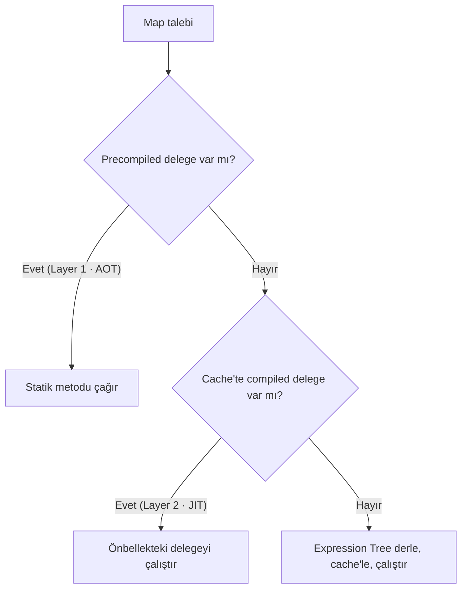

# Core Concepts

## Eşleme Mantığı

VeloxMapper, **kaynak (source)** ve **hedef (destination)** tür çiftleri için kurallar tutar. Varsayılan olarak **aynı isimli ve uyumlu tipteki** property'ler otomatik eşleşir (case-insensitive). İsimleri veya tipleri uyuşmayan alanlar `ForMember` ile açıkça yapılandırılır.

Eşleme kaynağı çözümleme sırası (bir hedef üye için):

1. `ForMember` ile tanımlı `MapFrom` / resolver / converter
2. İsimle eşleşen kaynak property/field (prefix/postfix/naming convention destekli)
3. **Flattening** — `Address.City` → hedef `AddressCity`
4. **IncludeMembers** — alt nesnelerin üyeleri (ilk eşleşen kazanır)

## Yapılandırma Yaklaşımı

İki yol vardır:

**Inline** — `MapperConfiguration` delegesi içinde `CreateMap`:

```csharp
var config = new MapperConfiguration(cfg => cfg.CreateMap<User, UserDto>());
```

**Profil** — kuralları modüler `VeloxProfile` sınıflarında toplayın:

```csharp
using VeloxMapper;

public class UserProfile : VeloxProfile
{
    public UserProfile()
    {
        CreateMap<User, UserDto>().ReverseMap();
    }
}
```

Profiller assembly taramasıyla otomatik kaydedilir (`AddVeloxMapper(assembly)` veya `cfg.AddProfilesFromAssembly(...)`).

## Yaşam Döngüsü

- **`MapperConfiguration`** oluşturulduktan sonra **dondurulur (immutable)**.
- **`IVeloxMapper`** thread-safe'dir; **Singleton** olarak kaydedilmelidir.
- Doğrulama (`AssertConfigurationIsValid`) ve ön derleme (`CompileMappings`) başlangıçta bir kez çağrılır.

## Hibrit Çift Katmanlı Motor



### Layer 1 — Source Generator (`[VeloxMap]`)
`[VeloxMap(typeof(User), typeof(UserDto))]` ile işaretli tipler için Roslyn, derleme zamanında **reflection içermeyen, NativeAOT uyumlu** uzantı metotları üretir.

### Layer 2 — Expression Tree + Context Pooling
Source generator'ın kapsamadığı dinamik senaryolarda önceden derlenip önbelleğe alınan expression delegeleri devreye girer. `RequiresContext` analizi ile basit eşlemeler **sıfır-context, sıfır-allocation** derlenir; karmaşık kurallar için `ThreadStatic` reentrancy-safe context havuzu kullanılır.

## Çalışma Zamanı Bağlamı — `VeloxResolutionContext`

Resolver, converter, action ve koşul delegate'lerine aktarılan bağlam nesnesi:

| Üye | Tip | Açıklama |
| :--- | :--- | :--- |
| `Items` | `IDictionary<string, object>` | Çağrı başına runtime parametreleri |
| `Mapper` | `IVeloxMapper` | İç içe (nested) eşleme için |
| `ServiceProvider` | `IServiceProvider?` | DI çözümleme (opsiyonel) |
| `CurrentMember` | `string?` | Hata anında eşlenen üye adı |

➡️ Sonraki: [API Referansı](./api/mapper.md)
